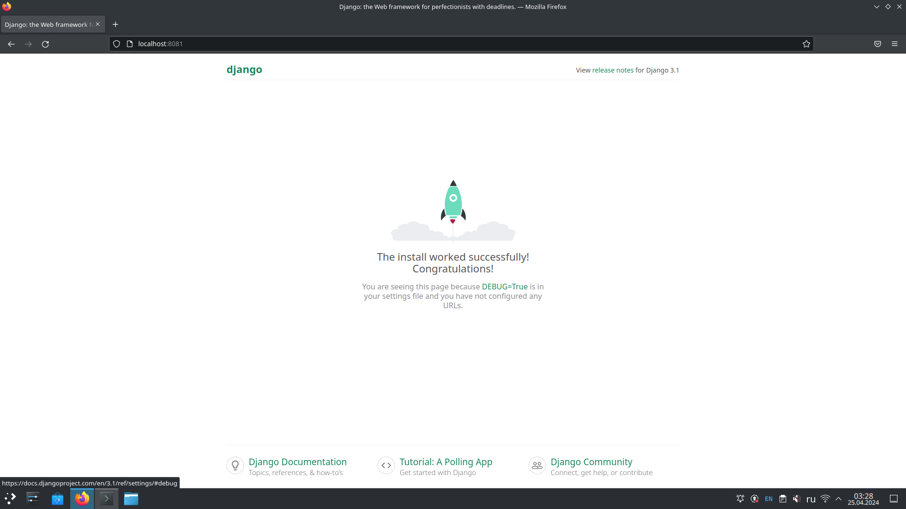
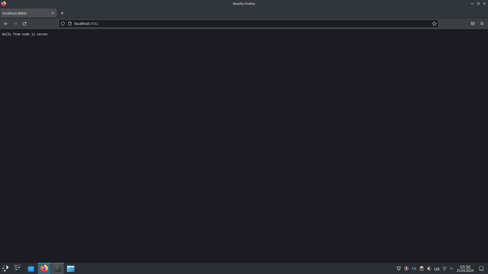
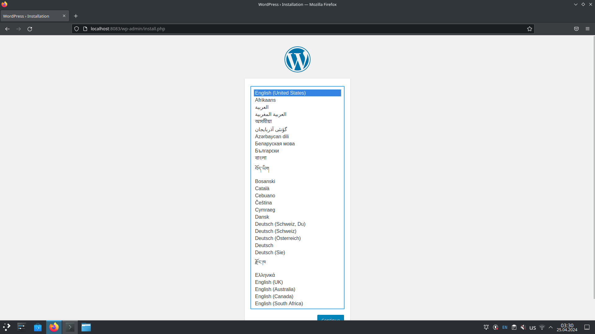

#Dynamic Web

Автоматическое развертывание стенда nginx + php-fpm (wordpress) + python (django) + js(node.js)

В итоге получаем vagrant стэнд с проброшенными на локалхост портами. Каждый порт на свой сайт. 
на порту 8081 - django 
на порту 8082 - node.js 
на порту 8083 - wordpress 
